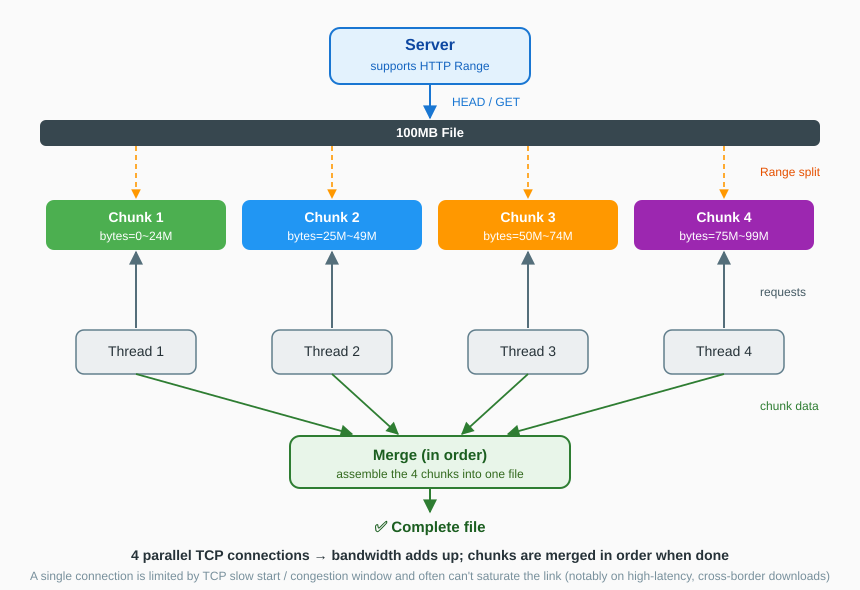
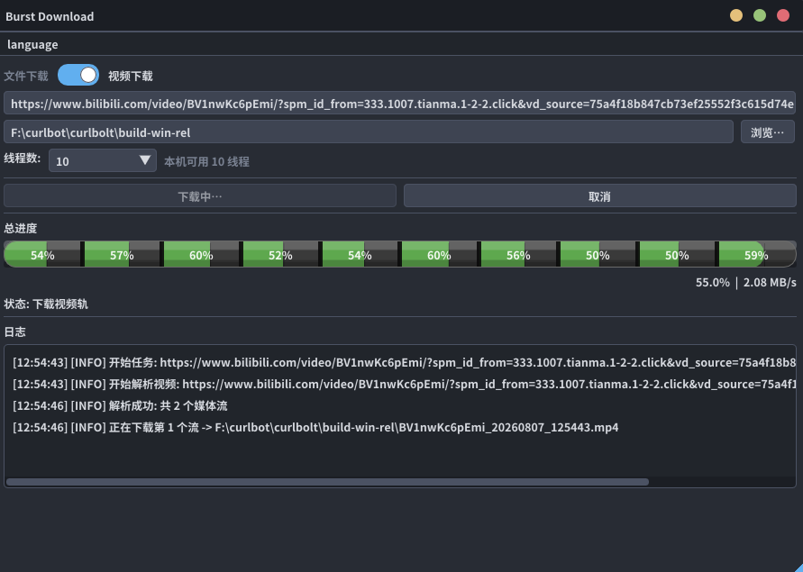

<div align="center">

[🇬🇧 English](README.md) · [🇨🇳 中文](README_ZH.md)

# ⚡ Burst Download

**Multi-threaded chunked downloader with video download support**


[](https://github.com/ErnestAgel/burst-download/stargazers)
[](https://github.com/ErnestAgel/burst-download/network)
[](https://github.com/ErnestAgel/burst-download/commits/main)
[](https://github.com/ErnestAgel/burst-download/actions/workflows/ci.yml)

> 🎬 **Video download**: one command to download videos from Bilibili / YouTube and other popular sites
> ⚡ **Multi-threading**: HTTP Range chunking with 1–8 threads (default adaptive to CPU cores) to saturate bandwidth
> 📦 **Resume support**: continue from where it stopped instead of restarting
> 🖥 **Three-platform builds**: Linux x86_64 / ARM64 / Windows; single-file Release per platform
> 🌐 **Website**: [burst-download.github.io](https://ernestagel.github.io/burst-download/) — landing page with screenshots, usage guide & download links

</div>

---

## ⬇️ Download & Install

Grab the latest binaries from the [Releases page](https://github.com/ErnestAgel/burst-download/releases):

| Platform | Package | Run |
|---|---|---|
| Windows x86_64 | `burst-windows-x86_64.zip` (exe + runtime DLLs) | unzip, then `burst.exe` |
| Linux x86_64 | `burst-linux-x86_64` (single file) | `./burst` |
| Linux ARM64 | `burst-linux-aarch64` (single file) | `./burst` |

```bash
# CLI quick start
./burst https://example.com/file.iso -o file.iso -t 8 --timeout 30

# Video download (Bilibili / YouTube / more)
./burst --video "https://www.bilibili.com/video/BVxxxx" -o movie
```

> 🗺️ Package-manager installs (winget / scoop / Homebrew / apt) are on the roadmap — watch the repo to get notified.

---

## 🔐 Release integrity & Windows SmartScreen

Windows binaries are **not Authenticode-signed** (open-source project without a paid certificate), so Windows may show a SmartScreen *"Windows protected your PC"* prompt on first run — click **More info → Run anyway**. The [public key](burst-public-key.asc) and per-file GPG signatures (`.sig`) verify each release's authenticity and integrity:

```bash
# import the release signing public key (also attached to every release)
gpg --import burst-public-key.asc

# verify a file against its detached signature
gpg --verify burst-windows-x86_64.zip.sig burst-windows-x86_64.zip

# verify checksums
sha256sum -c SHA256SUMS.txt
```

Release signing key fingerprint: `1C5F F3B1 7A21 6A32 1AE1 7566 4A8E 6102 2774 824C`

---

## ✨ Features

| | Description |
|---|---|
| 🎬 **Video download** | `--video` mode: pass a video page URL, the built-in parser resolves the media stream (Bilibili / YouTube and more), then downloads with multi-threaded chunking; DASH streams are **auto-merged** into one file (MP4 / WebM containers) |
| ⚡ **Multi-threaded** | `-t` 1–8 threads (default 2–4, adaptive to CPU cores), HTTP Range chunking, the last chunk absorbs the remainder |
| 📦 **Resume** | Automatically detects an existing local file and resumes; falls back to single-thread when the server lacks Range support |
| ⏱ **Timeout & logging** | `--timeout` / `--no-timeout` control; timeouts and failure details are written to `download.log` |
| 🍪 **Cookie support** | `--cookies-from-browser` reads browser login state (Bilibili 720p+ streams), `--cookie` for manual cookies |
| 🛡 **Referer** | Automatically sends the video page Referer to avoid anti-hotlinking 403s |
| 🖥 **Cross-platform** | Linux x86_64 / Linux aarch64 / Windows; **Debug (dynamic libs) + Release (static single-file) dual builds**; on Windows the runtime DLLs must sit next to the exe (copied automatically by CMake) |

---

## 💡 Why Burst Download?

**Compared with traditional download tools (curl / wget):**

| | curl / wget | burst |
|---|---|---|
| Connections | single-threaded, single connection | 1–8 concurrent connections |
| Bandwidth | limited by TCP slow start / congestion window; often can't saturate high-bandwidth, high-latency links | parallel connections approach the bandwidth ceiling |
| Resume | manual `curl -C -` | automatic detection & resume |
| Video download | ❌ not supported | `--video` auto-resolves stream URLs |
| Logging / timeout | none | timeout interrupt + `download.log` |

**Good fit ✅**

- GitHub Releases, software mirrors, CDNs and other Range-capable static resources
- Large files: ISOs, archives, datasets, model weights
- Direct video stream downloads (Bilibili / YouTube)

**Not a fit ❌**

- **Account-rate-limited** cloud drives (e.g. Baidu Pan): the server throttles per account, so more threads don't increase total throughput
- Servers without Range support (automatically falls back to single-thread)
- Private drives requiring login + dynamic signatures (no direct links)

---

## ⚙️ How It Works



1. **HTTP Range chunking**: send requests like `Range: bytes=0-26214399` to split a large file into N chunks;
2. **Multi-threaded concurrency**: N threads each hold an independent TCP connection and pull their own chunk simultaneously;
3. **Why it's faster**: a single TCP connection is limited by **slow start + congestion window**, so the actual rate often stays below the bandwidth ceiling (especially on high-latency links, e.g. cross-border downloads); parallel connections add up and approach the ceiling;
4. **Prerequisites**: the server must support Range and **not throttle per account** — static file servers / CDNs naturally qualify; account-limited drives like Baidu Pan don't, so more threads change nothing;
5. **Final assembly**: chunks are written to disk and merged into the complete file (the last chunk absorbs the remainder).

---

## 🎬 Video Download

One command for any supported site:

```bash
# Download a Bilibili video (auto-resolve + multi-threaded download)
./burst --video "https://www.bilibili.com/video/BVxxxxxxxx" -o movie

# Bilibili 720p+ (requires being logged in to Bilibili in the browser)
./burst --video "https://www.bilibili.com/video/BVxxxxxxxx" -o movie --cookies-from-browser chrome

# YouTube and other popular video sites
./burst --video "https://www.youtube.com/watch?v=xxxxx" -o clip
```

- Works with Bilibili, YouTube and other popular sites — just paste the video page URL
- DASH streams: video + audio tracks are downloaded and **auto-merged** into one file (in-process, no external tools). The output container follows the video codec: VP9/AV1 → `.mkv`, otherwise → `.mp4`. Temporary tracks are deleted after a successful merge.
- **Overwrite protection**: without `-o`, names come from the URL plus a timestamp (e.g. `10Mb_20260807_123456.dat`, `BVxxxx_20260807_123456_full.mkv`); with explicit `-o`, if the target already exists a timestamp is appended instead of overwriting.

---

## 🚀 Quick Start

```bash
./burst <url> [-o filename] [-t threads] [--timeout sec] [--no-timeout]
./burst --video <video-url> [-o basename] [-t threads] [--timeout sec]
```

```bash
# Download a file (8 threads, 30s no-progress timeout)
./burst https://example.com/file.iso -o file.iso -t 8 --timeout 30

# Download a video
./burst --video "https://www.bilibili.com/video/BVxxxx" -o movie

# Force download without auto-interruption
./burst https://example.com/file.iso -o file.iso --no-timeout

# Show help
./burst -h
```

Live **progress / speed / ETA** output:

```
percent: 42% speed: 3.20 MB/s ETA: 00:05:12
```

---

## 🔨 Build

The project ships prebuilt libcurl libraries, a minimal static FFmpeg and the Python runtime for all three platforms (`third_party/`) — no need to install dev packages.

**Debug (default)**: links dynamic libraries, convenient for gdb

```bash
cmake -B build . && cmake --build build        # Linux
cmake -B build -G "MinGW Makefiles" .          # Windows (MSYS2/mingw64 env, gcc and mingw32-make on PATH)
```

**Release**: links static libraries into a **single-file binary**. On Windows, the DLLs under `third_party/python/windows-x86_64/dll/` must sit next to the exe (copied automatically by CMake) — unpack and run. On Linux, curl/openssl/python/ffmpeg are static from the repo while glibc is dynamic; the binary depends on the desktop's `libGL`/`libX11` at runtime; the artifact is a single file. The video parser ships with the program and works out of the box.

```bash
# Linux (static openssl prepared by the build script)
cmake -B build -DCMAKE_BUILD_TYPE=Release -DOPENSSL_ROOT=/path/to/openssl \
      -DCURL_STATIC_DEPS="/path/libz.a;/path/libzstd.a" .
cmake --build build
# Windows (native Schannel TLS, no openssl needed)
cmake -B build -DCMAKE_BUILD_TYPE=Release .
cmake --build build
```

---

## 🖥️ GUI



The GUI provides **File Download + Video Download** operations and is supported on **Windows x86_64 / Linux x86_64** (the Linux aarch64 build has no GUI).

**Run**:

```bash
./burst                 # open the GUI
./burst --gui           # explicitly open the GUI
./burst <url> ...       # terminal CLI download
```

Windows: double-click `burst.exe` to open the GUI; Linux: run `./burst` with no arguments to open the GUI (depends on the desktop's `libGL`/`libX11`).

**Build** (`option(BUILD_GUI ON)` by default):

```bash
# Windows (MSYS2/mingw64)
cmake -B build -G "MinGW Makefiles" -DCMAKE_BUILD_TYPE=Release .
cmake --build build --target burst      # produces burst.exe

# Linux (needs X11 dev packages: libgl1-mesa-dev libx11-dev libxrandr-dev
#   libxinerama-dev libxcursor-dev libxi-dev)
cmake -B build -DCMAKE_BUILD_TYPE=Release .
cmake --build build --target burst      # produces burst
```

**Supported**:

- 🎨 **Atom One Dark theme**; Windows: frameless window with Mac-style buttons (minimize/maximize/close); Linux: native title bar
- ⚡ Multi-threaded segmented download (1–8 threads selectable, default adaptive to CPU cores)
- 🎬 **Video download** (Bilibili / YouTube etc.): parse → download video/audio tracks (parallel chunks) → auto-merge, with 4-stage status shown live (Parsing / Downloading video track / Downloading audio track / Merging)
- ⏸️ **Pause / Resume / Stop** state machine: first "Cancel" click pauses (cache kept, **segmented resume** via `.curlbolt.part` metadata — only unfinished parts re-download); red "Stop" deletes cache and resets UI
- 📊 **3D cylinder progress bar** (battery-cell chunks): completed cells green, active cell growing, 5px separators, per-cell percentage, hover shows per-thread speed; overall % + speed bottom-right
- 📁 Save to a directory only — filename is derived from the URL automatically; "Browse…": native folder dialog on Windows / built-in directory browser on Linux (zero deps)
- ⚡ **Thunder links** (`thunder://`) decoded automatically
- 🌐 Bilingual UI (menu bar shows target-language hint: `language` in Chinese UI, `中文` in English UI)
- 🪟 Windows: frameless full-edge resize (left/right/bottom + corners, min 640×480), DPI-aware; Linux: native title bar (drag & resize)
- 💾 Fonts and third-party libs bundled and distributed with the repo; no extra installs

---

## ⚠️ Notes

- Requires server support for **HTTP Range** (static file servers usually support it; falls back to single-thread otherwise);
- **Video mode** works with Bilibili / YouTube and other popular sites; Bilibili 720p+ streams require login state (`--cookies-from-browser chrome`);
- **Resume** uses segmented metadata (`.curlbolt.part`); the target file is pre-allocated (sparse) so its size always matches — delete the file together with its `.curlbolt.part` to restart clean;
- Timeout: interrupts after 60s with no progress by default; `--timeout N` adjusts it, `--no-timeout` disables it.

---

## ⚠️ Disclaimer

This tool is intended only for downloading content **you have the right to obtain** (e.g. personal backups, study & research, public domain or CC-licensed material). Do not use it to download, redistribute or commercially exploit copyrighted content, nor for any unlawful purpose. **Users bear full legal responsibility; the author assumes no liability for any use of this tool.**

本工具仅用于下载**您有权获取**的内容（如个人备份、学习研究、公有领域或 CC 协议素材）。请勿用于下载、传播或商用受版权保护的内容，也不得用于任何违法行为。**使用者应自行承担全部法律责任，作者不对任何使用行为负责。**

---

## 📄 License

This project is licensed under the **MIT License** (Copyright © 2026 ErnestAgel) — free to use, modify, commercialize and redistribute.

[](https://opensource.org/licenses/MIT)
