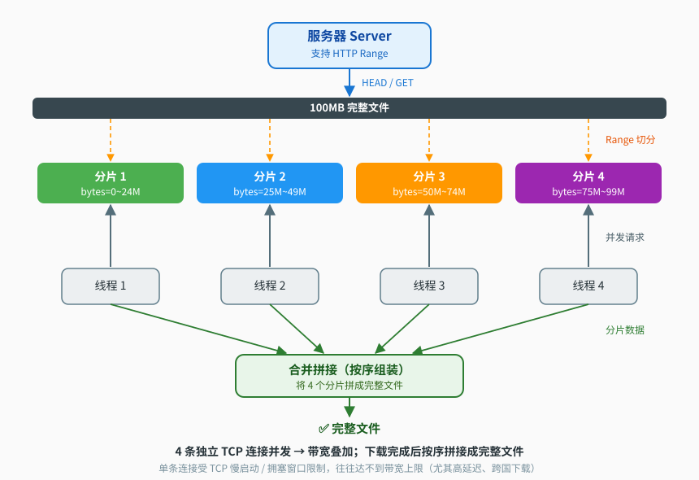

<div align="center">

[🇨🇳 中文](README.md) · [🇬🇧 English](README_EN.md)

# ⚡ curlbolt

**多线程分片下载器 · 支持视频下载**  
**Multi-threaded chunked downloader with video download support**


[](https://github.com/ErnestAgel/curlbolt/stargazers)
[](https://github.com/ErnestAgel/curlbolt/network)
[](https://github.com/ErnestAgel/curlbolt/commits/main)

> 🎬 **视频下载**：一条命令下载 B站 / YouTube 等主流网站的视频，多线程分片下载
> ⚡ **多线程加速**：HTTP Range 分片，1~10 线程并发，榨干带宽
> 📦 **断点续传**：中断后从断点继续，不重头来
> 🖥 **三平台构建**：Linux x86_64 / ARM64 / Windows；Linux Release 静态单文件零依赖，Windows Release 随附 Python 运行 dll（CMake 自动复制到 exe 目录）

</div>

---

## ✨ 特性 Features

| | 说明 Description |
|---|---|
| 🎬 **视频下载** | `--video` 模式：输入视频网页 URL，自动解析媒体流直链（B站/YouTube 等主流网站），多线程分片下载；音视频分离流（DASH）下载后**自动合并**为单文件（MP4 / WebM 多格式容器） |
| 🔄 **解析器在线更新** | `--update-parser` 一键把内置视频解析组件升级到最新版（需网络，无需重新编译/重新发布） |
| ⚡ **多线程并发** | `-t` 1~10 线程，HTTP Range 分片，最后一个分片负责余数 |
| 📦 **断点续传** | 自动检测本地已存在文件并从断点继续；服务器不支持 Range 时自动退化为单线程 |
| ⏱ **超时中断与日志** | `--timeout` / `--no-timeout` 控制；超时中断、失败详情写入 `download.log` |
| 🍪 **Cookie 支持** | `--cookies-from-browser` 读浏览器登录态（B站 720p+ 高清流）、`--cookie` 手动指定 |
| 🛡 **防盗链 Referer** | 自动携带视频页 Referer，B站等视频流防 403 |
| 🖥 **跨平台** | Linux x86_64 / Linux aarch64 / Windows；**Debug（动态库调试）+ Release（静态单文件发布）双构建**；Windows 因内嵌 Python 解释器，Release 需将运行 dll 与 exe 同目录（构建时自动复制） |

---

## 💡 为什么用 curlbolt？Why curlbolt?

**对比传统下载工具（curl / wget）：**

| | curl / wget | curlbolt |
|---|---|---|
| 连接数 | 单线程、单连接 | 1~10 个并发连接 |
| 带宽利用 | 单连接受 TCP 慢启动/拥塞窗口限制，高带宽高延迟网络常吃不饱 | 多连接并行，逼近带宽上限 |
| 断点续传 | `curl -C -` 需手动指定 | 自动检测本地文件，断点续传 |
| 视频下载 | ❌ 不支持 | `--video` 自动解析直链下载 |
| 日志/超时 | 无 | 超时中断 + `download.log` |

**适用场景 ✅**

- GitHub Releases、软件源、镜像站、CDN 等支持 Range 的静态资源
- 大文件：ISO、压缩包、数据集、模型权重
- 视频网站直链下载（B站 / YouTube）

**不适用场景 ❌**

- 百度网盘等**账号级限速**网盘：服务端按账号限速，多线程总量不变
- 不支持 Range 的服务器（自动退化为单线程）
- 需登录 + 动态签名的私有网盘（无直链）

---

## ⚙️ 加速原理 How It Works



1. **HTTP Range 分片**：向服务器发送 `Range: bytes=0-26214399` 这类请求，把大文件切成 N 段；
2. **多线程并发**：N 个线程各持一条独立 TCP 连接，同时拉取自己的分片；
3. **为什么能加速**：单条 TCP 连接受**慢启动 + 拥塞窗口**限制，实际速率往往达不到带宽上限（高延迟网络尤其明显，如跨国下载）；多连接并行叠加，就能逼近带宽上限；
4. **前提条件**：服务器支持 Range 且**不设账号级限速**——静态文件服务器 / CDN 天然满足；百度网盘这类按账号限速的不满足，开再多线程总量也不变；
5. **收尾拼接**：各分片落盘后合并为完整文件（最后一个分片负责余数）。

---

## 🎬 视频下载（亮点 Video Download）

一条命令，任意支持网站：

```bash
# 下载 B站视频（自动解析 + 多线程分片下载）
./curlbolt --video "https://www.bilibili.com/video/BVxxxxxxxx" -o movie

# B站高清 720p+（需要浏览器已登录 B站）
./curlbolt --video "https://www.bilibili.com/video/BVxxxxxxxx" -o movie --cookies-from-browser chrome

# YouTube 等主流视频网站
./curlbolt --video "https://www.youtube.com/watch?v=xxxxx" -o clip
```

- 支持 B站、YouTube 等主流视频网站，视频网页地址直接可用
- 音视频分离流（DASH）自动下载视频轨 + 音频轨，并**自动合并**为单文件（内置合并引擎，全程进程内，无需外部工具）：输出容器按视频编码自动选择——VP9/AV1 视频轨 → `.mkv`，其余 → `.mp4`；合并成功后自动删除音视频中间文件
- **文件命名防覆盖**：未指定 `-o` 时按 URL 推断 + 时间戳命名（如 `10Mb_20260807_123456.dat`、`BVxxxx_20260807_123456_full.mkv`）；显式 `-o` 指定的目标已存在时自动追加时间戳避让，不会覆盖已有文件

---

## 🚀 快速开始 Quick Start

```bash
./curlbolt <url> [-o filename] [-t threads] [--timeout sec] [--no-timeout]
./curlbolt --video <video-url> [-o basename] [-t threads] [--timeout sec]
./curlbolt --update-parser
```

```bash
# 下载文件（8 线程，30 秒无进展超时）
./curlbolt https://example.com/file.iso -o file.iso -t 8 --timeout 30

# 下载视频
./curlbolt --video "https://www.bilibili.com/video/BVxxxx" -o movie

# 强制下载不自动中断
./curlbolt https://example.com/file.iso -o file.iso --no-timeout

# 在线更新视频解析组件（网站改版导致解析失效时自愈，无需重新编译）
./curlbolt --update-parser

# 查看帮助
./curlbolt -h
```

终端实时输出**进度 / 速率 / 剩余时间**：

```
percent: 42% speed: 3.20 MB/s ETA: 00:05:12
```

---

## 🔨 构建 Build

项目自带三平台 libcurl 库、最小化 FFmpeg 静态库与 Python 嵌入运行时（`third_party/`），无需安装开发包。

**Debug（默认）**：链接动态库，便于 gdb 调试

```bash
cmake -B build . && cmake --build build        # Linux
cmake -B build -G "MinGW Makefiles" .          # Windows（MSYS2/mingw64 环境，gcc 与 mingw32-make 需在 PATH）
```

**Release**：链接静态库，Linux 产出**单文件可执行程序**（无动态依赖，用于发布）；Windows 由于内嵌 Python 解释器，需将 `third_party/python/windows-x86_64/dll/` 下的 dll 与 exe 同目录（CMake 构建时自动复制）

```bash
# Linux（openssl 静态库由构建脚本准备）
cmake -B build -DCMAKE_BUILD_TYPE=Release -DOPENSSL_ROOT=/path/to/openssl \
      -DCURL_STATIC_DEPS="/path/libz.a;/path/libzstd.a" .
cmake --build build
# Windows（Schannel 原生 TLS，无需 openssl）
cmake -B build -DCMAKE_BUILD_TYPE=Release .
cmake --build build
```

---

## ⚠️ 注意事项 Notes

- 需要服务器支持 **HTTP Range**（静态文件服务器通常都支持；不支持时自动退化单线程）；
- **视频模式**支持 B站/YouTube 等主流网站；B站 720p+ 高清流需登录态（`--cookies-from-browser chrome`）；
- **断点续传**仅比较文件大小，远程内容变更时建议删除本地文件重新下载；
- 超时机制：默认 60 秒无进展自动中断，`--timeout N` 调整，`--no-timeout` 禁用。

---

## ⚠️ 免责声明 Disclaimer

本工具仅用于下载**您有权获取**的内容（如个人备份、学习研究、公有领域或 CC 协议素材）。请勿用于下载、传播或商用受版权保护的内容，也不得用于任何违法行为。**使用者应自行承担全部法律责任，作者不对任何使用行为负责。**

This tool is intended only for downloading content **you have the right to obtain** (e.g. personal backups, study & research, public domain or CC-licensed material). Do not use it to download, redistribute or commercially exploit copyrighted content, nor for any unlawful purpose. **Users bear full legal responsibility; the author assumes no liability for any use of this tool.**

---

## 📄 License

本项目采用 **MIT License**（Copyright © 2026 ErnestAgel），允许自由使用、修改、商用与分发。  
**This project is licensed under the MIT License.**

内置 **FFmpeg**（[LGPL v2.1+](https://www.ffmpeg.org/legal.html)）静态库，仅用于音视频封装合并（remux），未作修改；LGPL 许可要求下，本仓库随附全部源码与链接说明。

[](https://opensource.org/licenses/MIT)
